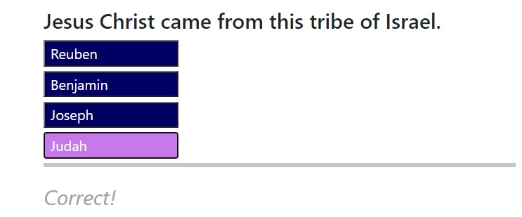
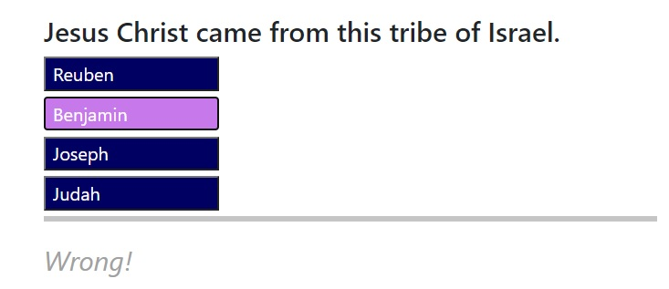

# Bible Character Quiz

## Description
This is a short quiz that will test your Bible Character knowledge. Your score will be based on the how fast you can give the correct answer. This App can be improve later to have more and randomized questions. Have fun!

## Tech/Framework
* HTML
* CSS
* Bootstrap
* JavaScript
* jQuery
* Single Page Application

## Technical Requirements
* Countdown before the quiz start
* Timed quiz
* Penalty for wrong answer
* Accept initial and store scores at the end of the quiz or when the time runs out
* Display high score
* Clear localStorage
* Display if the answer is correct or wrong

## Screenshots
* First Page   
* Countdown before the quiz   
* Questions - choices were intentionally hidden for these snaphots
    - Correct   
    - Wrong   
* Time runs out   
* Enter initial and show score   
* View high score   

## Quiz App Link
[Let's have fun!](https://jojobautistaum.github.io/bible-character-quiz/)
